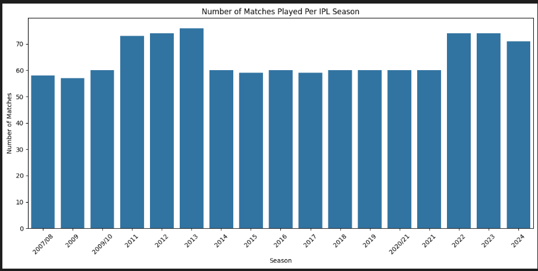
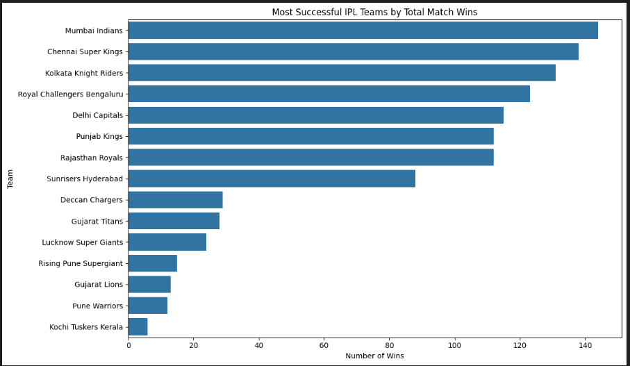
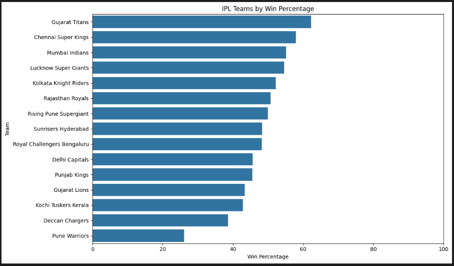
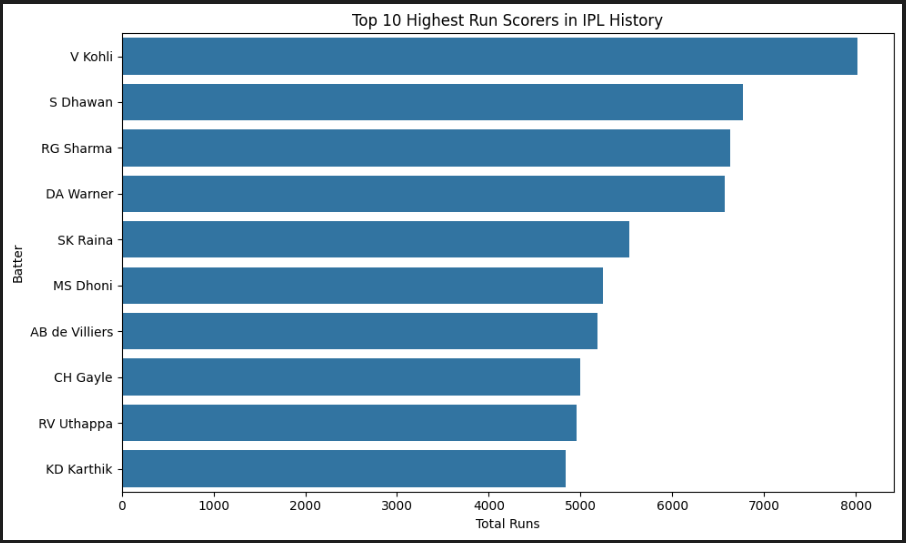
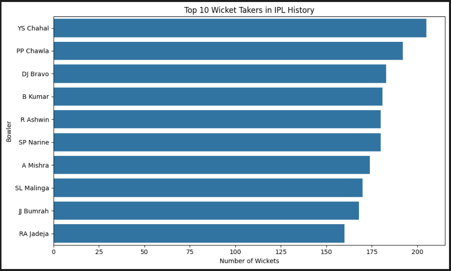
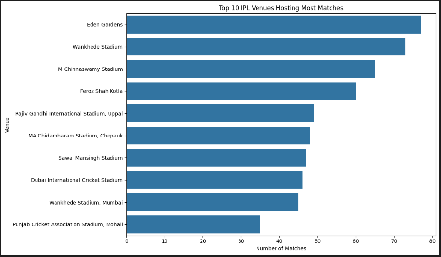

# 🏏 IPL Exploratory Data Analysis (IPL EDA)

An in-depth Exploratory Data Analysis (EDA) project on the **Indian Premier League (IPL)** dataset using Python. This project explores IPL matches and ball-by-ball delivery data to uncover meaningful insights about teams, players, venues, toss decisions, batting performance, bowling performance, match results, and scoring patterns.

---

## 📌 Project Overview

The Indian Premier League (IPL) is one of the most popular T20 cricket leagues in the world. With multiple seasons of match and ball-by-ball data available, IPL provides an excellent opportunity to perform detailed data analysis and discover interesting cricket insights.

This project performs a comprehensive Exploratory Data Analysis on IPL data and answers questions such as:

* How has the number of IPL matches changed across seasons?
* Which teams have won the most matches?
* Which teams have the best win percentages?
* Does winning the toss significantly impact match results?
* Who are the top run scorers in IPL history?
* Who has hit the most fours and sixes?
* Which bowlers have taken the most wickets?
* Which bowlers have the best economy rates?
* What are the highest and lowest team scores?
* Which teams perform best during Powerplay and Death Overs?

---

# 🎯 Project Objectives

The main objectives of this project are:

* Perform data cleaning and preprocessing on IPL datasets.
* Explore IPL match and ball-by-ball delivery data.
* Analyze team performance across IPL seasons.
* Study toss decisions and their impact on match outcomes.
* Identify top-performing batters and bowlers.
* Analyze team scoring patterns.
* Compare Powerplay and Death Overs performance.
* Generate meaningful insights using data visualization.

---

# 📂 Dataset

The project uses two main datasets:

### 🏏 Matches Dataset

Contains match-level information such as:

* Match ID
* Season
* City
* Date
* Teams
* Toss Winner
* Toss Decision
* Match Winner
* Result
* Venue
* Player of the Match

### 🏏 Deliveries Dataset

Contains ball-by-ball information such as:

* Match ID
* Innings
* Batting Team
* Bowling Team
* Batter
* Bowler
* Runs
* Extras
* Dismissals

---

# 🔍 Analysis Performed

## 🏏 1. General IPL Analysis

* Total Matches
* Total Deliveries
* Total Seasons
* Total Teams
* Total Venues
* Total Cities

---

## 📅 2. Season Analysis

* Matches played in each IPL season
* IPL growth across different seasons

---

## 🏟️ 3. City and Venue Analysis

* Cities hosting the most IPL matches
* Most frequently used IPL venues

---

## 🏆 4. Team Performance Analysis

* Matches played by each team
* Matches won by each team
* Team win percentage

---

## 🪙 5. Toss Analysis

* Teams winning the most tosses
* Toss decision analysis
* Batting vs Fielding decisions
* Toss winner vs Match winner comparison

---

## 🏅 6. Player Analysis

* Most Player of the Match awards
* Top-performing IPL players

---

## 🏏 7. Batting Analysis

* Top run scorers
* Players with the most fours
* Players with the most sixes
* Strike rate analysis

---

## 🎯 8. Bowling Analysis

* Top wicket takers
* Best economy rates
* Most dot balls

---

## 📈 9. Team Score Analysis

* Highest team scores
* Lowest completed innings scores
* Team innings performance

---

## 🏆 10. Match Result Analysis

* Biggest wins by runs
* Biggest wins by wickets

---

## ⚡ 11. Advanced Phase Analysis

### Powerplay Analysis

* Total Powerplay runs by team
* Powerplay run rates

### Death Overs Analysis

* Total Death Over runs by team
* Death Over run rates

---

# 📊 Key Insights

Some interesting insights discovered from the analysis include:

🏆 **Mumbai Indians** recorded the highest number of match wins in the dataset.

🏏 **Gujarat Titans** showed one of the highest win percentages among the teams analyzed.

🪙 Winning the toss did not guarantee winning the match, with the toss winner winning approximately **50.83%** of completed matches.

🏏 **V Kohli** emerged as the highest run scorer in the dataset.

🏏 **AB de Villiers** recorded the highest number of Player of the Match awards in the analysis.

💥 **CH Gayle** was among the leading players for six-hitting.

🎯 **YS Chahal** emerged as the leading wicket taker in the dataset.

📈 IPL teams generally scored at a much faster rate during the **Death Overs** compared to earlier phases of an innings.

---

# 📸 Visualizations

## 📅 Matches Per Season



---

## 🏆 Team Wins



---

## 📊 Team Win Percentage



---

## 🏏 Top Run Scorers



---

## 🎯 Top Wicket Takers



---

## 🏟️ Top IPL Venues



---


# 🛠️ Technologies Used

* 🐍 Python
* 📊 Pandas
* 🔢 NumPy
* 📈 Matplotlib
* 🎨 Seaborn
* 📓 Jupyter Notebook / VS Code

---

# 📁 Project Structure

```text
IPL-EDA/
│
├── IPL_EDA.ipynb
│
├── data/
│   ├── matches.csv
│   └── deliveries.csv
│
├── screenshots/
│   ├── matches_per_season.png
│   ├── team_wins.png
│   ├── team_win_percentage.png
│   ├── top_run_scorers.png
│   ├── top_wicket_takers.png
│   ├── top_venues.png
│
└── README.md
```

---

# 🚀 How to Run the Project

### 1️⃣ Clone the Repository

```bash
git clone <your-repository-url>
```

### 2️⃣ Navigate to the Project Folder

```bash
cd IPL-EDA
```

### 3️⃣ Install Required Libraries

```bash
pip install pandas numpy matplotlib seaborn jupyter
```

### 4️⃣ Open the Notebook

```bash
jupyter notebook IPL_EDA.ipynb
```

Run the notebook cells sequentially to reproduce the complete analysis.

---

# 📈 Skills Demonstrated

This project demonstrates the following Data Analytics skills:

* Data Cleaning
* Data Preprocessing
* Exploratory Data Analysis
* Data Aggregation
* GroupBy Operations
* Data Visualization
* Statistical Analysis
* Cricket Data Analysis
* Insight Generation

---

# 👩‍💻 Author

**Janaki**

B.Tech – Artificial Intelligence and Data Science

---

⭐ If you found this project interesting, feel free to star the repository!
